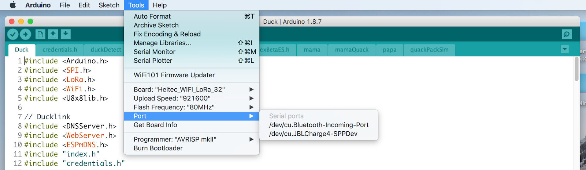
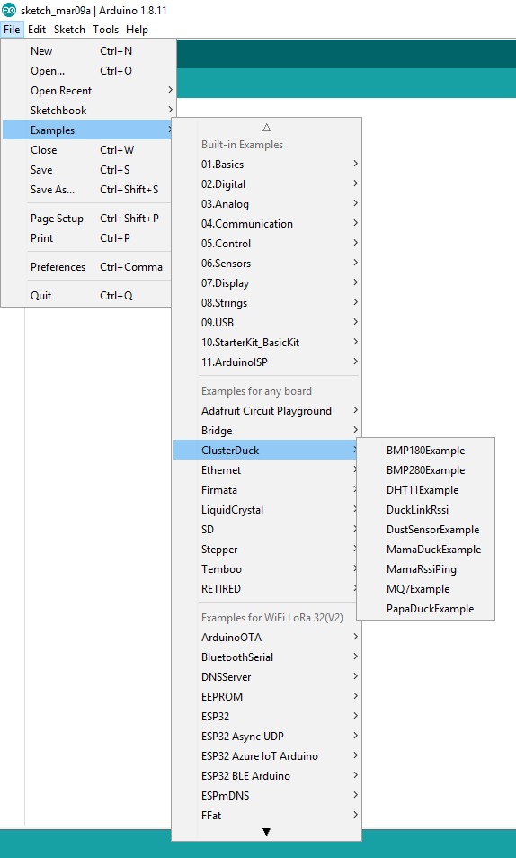
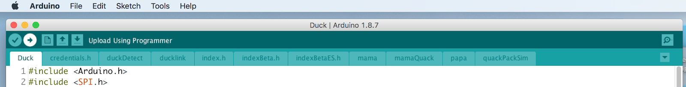

# How to build a duck

<!-- MarkdownTOC levels="2,3" autolink="true" -->

- [Duck Descriptions](#duck-descriptions)
    - [DuckLinks](#ducklinks)
    - [MamaDucks](#mamaducks)
    - [PapaDuck](#papaduck)
- [Raw Materials](#raw-materials)
    - [Software](#software)
    - [Hardware](#hardware)
- [PlatformIO](#platformio)
    - [Installing ClusterDuck-Protocol global](#installing-clusterduck-protocol-global)
    - [Installing ClusterDuck-Protocol for project only](#installing-clusterduck-protocol-for-project-only)
- [Arduino IDE](#arduino-ide)
    - [Install VCP Driver](#install-vcp-driver)
    - [Install the necessary libraries that work with ClusterDuck Protocol:](#install-the-necessary-libraries-that-work-with-clusterduck-protocol)
    - [Install ClusterDuck Protocol](#install-clusterduck-protocol)
    - [Load the Heltec ESP32 Board to your Arduino IDE:](#load-the-heltec-esp32-board-to-your-arduino-ide)
- [Install The firmware](#install-the-firmware)
- [Setting up the IBM Watson IoT Platform](#setting-up-the-ibm-watson-iot-platform)
- [FAQs](#faqs)
    - [General](#general)
    - [Errors when compiling](#errors-when-compiling)
    - [Setup Issues](#setup-issues)
    - [Cloud Errors](#cloud-errors)
- [API Reference And Quickstart ClusterDuck Protocol](#api-reference-and-quickstart-clusterduck-protocol)
    - [Quick Start](#quick-start)
    - [API](#api)

<!-- /MarkdownTOC -->

## Duck Descriptions


Ducks are IoT devices that connect together to form simple mesh networks.  The Ducks utilize a combined network of LoRa (Long Range) technology, WiFi, Bluetooth, and sometimes other connectivities. When the Ducks need to communicate with each other they transmit over LoRa, a long-range and power efficient radio protocol. Often a user will need to communicate with the Ducks and may use WiFi.  A networked cluster of Ducks - a _ClusterDuck_ - is composed of several types of ducks: the DuckLink, MamaDuck, PapaDuck.


### DuckLinks

These are the basic nodes of the mesh network. The DuckLinks create a WiFi network where users can connect to it and submit emergencies. The DuckLink collects that data and transmits it to the MamaDuck using LoRa (915 MHz in the United States, 433 MHz in Europe and Asia). Anyone with a working WiFi device such as a smartphone or laptop can connect to a DuckLink.

### MamaDucks

MamaDucks act as central hubs to DuckLink groups.  The MamaDuck is able to receive data over LoRa from the DuckLinks and transmit this data further into the network.  This transmission can occur through other MamaDucks on the way towards the PapaDuck (once again using LoRa). The MamaDuck has most of the same properties as a DuckLink, though small changes in the device firmware help to optimize the architecture of the network.

### PapaDuck

PapaDuck is the final Duck in the ClusterDuck and transmits network data to the internet.  When communicating with other Ducks the PapaDuck similarly uses LoRa. The data that the PapaDuck receives gets pushed to the OWL Data Management System (DMS), the cloud platform, through the Internet. It acts like a gateway that collects data from MamaDucks and then upload it to the DMS.
                        
## Raw Materials

### Software

You will need the [Arduino IDE](https://www.arduino.cc/en/main/software) to install the firmware on your Arduino devices.

Or you can use your favorite Code editor with the [PlatformIO](https://platformio.org/) plugin.

The DuckLinks use our [ClusterDuck](https://github.com/Code-and-Response/ClusterDuck-Protocol) Protocol. Project OWL’s open source Duck firmware.

Depending on your computer setup, you may also need [USB to UART drivers](https://www.silabs.com/products/development-tools/software/usb-to-uart-bridge-vcp-drivers).   If you have any problems, please reach out on the [Project OWL Github](https://github.com/Project-Owl) or in the [Project OWL slack.](https://www.project-owl.com/slack)

### Hardware

There are many combinations of electronics, batteries, and enclosures that can be used to build a Duck. The following are a recommended minimum set of materials commonly used to create a functional Duck:

* **LoRa Board:** Heltec ESP32 WiFi + LoRa board, such as [this](https://www.amazon.com/MakerFocus-Development-Bluetooth-0-96inch-Display/dp/B076MSLFC9/ref=sr_1_3)

* **Battery:** 3.7v 1.25 Micro JST battery, such as [this](https://www.amazon.com/MakerFocus-Rechargable-Protection-Insulated-Development/dp/B07CXNQ3ZR/ref=sr_1_2)

* **Data Transfer Cable:** USB Micro connector to USB for your computer, such as [this](https://www.amazon.com/AmazonBasics-Male-Micro-Cable-Black/dp/B072J1BSV6/ref=sr_1_3)

* **Enclosure:** Plastic Box (or 3D print, or rubber ducky, or anything you want really) if a case is necessary, [this](https://www.amazon.com/gp/product/B07DVS1HC4/ref=ppx_yo_dt_b_asin_title_o06_s00?ie=UTF8&psc=1) would work.


##  PlatformIO

[PlatformIO](https://platformio.org/) is a ecosystem for embedded development. Grab your favorite IDE from [here](https://platformio.org/install/integration) and make sure to install the PlatformIO IDE extension. If you are not sure which IDE to use, use [VSCode](https://docs.platformio.org/en/latest/integration/ide/vscode.html#installation).

### Installing ClusterDuck-Protocol global

1. From the [PIO Home](https://docs.platformio.org/en/latest/integration/ide/vscode.html#setting-up-the-project) tab select `Libraries`
1. Search for `ClusterDuck Protocol` and install it

### Installing ClusterDuck-Protocol for project only

1. Create a `New Project` from the [PIO Home](https://docs.platformio.org/en/latest/integration/ide/vscode.html#setting-up-the-project) tab
1. Choose a name, select the `Heltec Wifi LoRa 32 (V2) (Heltec Automation)` as board and `Arduino` as framework
1. Open the `platformio.ini` within your newly created project and add `lib_deps = ClusterDuck Protocol` at the end.

## Arduino IDE

Open Arduino IDE.  If you do not have this developer environment yet, download the Arduino IDE [here](https://www.arduino.cc/en/main/software)

Download USB to UART Bridge VCP Driver from [here](https://www.silabs.com/products/development-tools/software/usb-to-uart-bridge-vcp-drivers)

### Install VCP Driver

#### MacOS:

* Make sure you click on the folder that says Legacy MacVCP Driver and then click on ‘Silicon Labs VCP Driver.pkg’
* Once it is finished installing, go to Mac System Preferences -> Security and Privacy -> General. Make sure Silicon Labs is allowed.

#### Ubuntu Linux Platforms: 
*  The driver is already installed on your machine due to latest kernels. you can check to see by running the following commands. 
```ls -al /lib/modules/"$(uname -r)"/kernel/drivers/usb/serial/usbserial.ko
```
```
ls -al /lib/modules/"$(uname -r)"/kernel/drivers/usb/serial/cp210x.ko
```

### Install the necessary libraries that work with ClusterDuck Protocol: 

#### Add ESP32 Board Library

1. Open Arduino
1. Go to Preferences, and in the “Additional Boards Manager URLs” please add the following string:

    https://dl.espressif.com/dl/package_esp32_index.json,https://adafruit.github.io/arduino-board-index/package_adafruit_index.json


    

### Install ClusterDuck Protocol

###### Using the Library Manager “COMING SOON”

## Importing as a .zip Library

In the Arduino IDE, navigate to _Sketch > Include Library > Add .ZIP Library_. At the top of the drop down list, select the option to "Add .ZIP Library".


Navigate to the downloaded ClusterDuck Protocol Folder and select.


Return to the _Sketch > Include Library menu._ menu. You should now see the library at the bottom of the drop-down menu. It is ready to be used in your sketch. The zip file will have been expanded in the _libraries_ folder in your Arduino sketches directory.

#### Manual Install

You will need to clone the ClusterDuck Protocol onto your local machine and include the libraries folder into your local arduino libraries folder.

1. Clone the ClusterDuck Protocol onto your local machine `git clone https://github.com/Code-and-Response/ClusterDuck-Protocol.git`
1. Pull all the Library submodules needed for the Arduino IDE `git submodule update --init --recursive`
1. Copy the `ClusterDuck-Protocol`folder into your local Arduino Libraries folder **MacOs** _/Users/USER/Documents/Arduino/_. **windows** _C:/Users/USER/Documents/Arduino._
1. Navigate into the `ClusterDuck-Protocol` folder and open `Libraries` folder
1. Copy all the libraries form the `Libraries` folder
1. Paste into into your local Arduino Libraries folder **MacOs** _/Users/USER/Documents/Arduino/_.  **windows** _C:/Users/USER/Documents/Arduino._
1. Open Arduino IDE
1. You should now be able to see the examples by going to File -> Examples -> ClusterDuck

You should be able pull new commits directly to this folder in your Arduino library.


#### Add required libraries

The required libraries to work with the ClusterDuck protocol can be installed in multiple ways. There is a folder in the source code that is called “Libraries” and contains all the submodules to work with the ClusterDuck Protocol. Or you can download all the libraries manual and import into Arduino by .zip. Some libraries are available in the Arduino Libraries manager. 

You should be able pull new commits directly to this folder in your Arduino library.

## Installing libraries through Library Manager

Some Libraries can be installed with the Arduino Library manager. 

Go to _Sketch > Include Library > Manage Libraries_:

* Search for LoRa and install _LoRa by Sandeep Mistry_
* Search for u8g2 and install _u8g2 by Oliver_
* Search for ArduinoJson and install _ArduinoJson by Benoit Blanchon_


## Installing libraries by adding .Zip files

To add Libraries by zip files. Go to _Sketch > include Library > add .zip Library…_

Go to the following websites and download the Libraries:

* [adafruit/Adafruit-BMP085-Library: A powerful but easy to use BMP085/BMP180 Library](https://github.com/adafruit/Adafruit-BMP085-Library)
* [adafruit/Adafruit_BMP280_Library: Arduino Library for BMP280 sensors](https://github.com/adafruit/Adafruit_BMP280_Library)
* [https://arduinojson.org/v6/doc/installation/](https://arduinojson.org/v6/doc/installation/) Version 6
* [me-no-dev/AsyncTCP: Async TCP Library for ESP32](https://github.com/me-no-dev/AsyncTCP)
* [adafruit/DHT-sensor-library: Arduino library for DHT11, DHT22, etc Temperature & Humidity Sensors](https://github.com/adafruit/DHT-sensor-library)
* [https://github.com/ThingPulse/esp8266-oled-ssd1306](https://github.com/ThingPulse/esp8266-oled-ssd1306)
* [https://github.com/me-no-dev/ESPAsyncWebServer](https://github.com/me-no-dev/ESPAsyncWebServer)
* [https://github.com/FastLED/FastLED](https://github.com/FastLED/FastLED)
* [https://github.com/sandeepmistry/arduino-LoRa](https://github.com/sandeepmistry/arduino-LoRa)
* [https://github.com/swatish17/MQ7-Library](https://github.com/swatish17/MQ7-Library)
* [https://github.com/knolleary/pubsubclient](https://github.com/knolleary/pubsubclient)
* [https://github.com/olikraus/u8g2](https://github.com/olikraus/u8g2)
* [https://github.com/mkarawacki/wavesharesharpdustsensor](https://github.com/mkarawacki/wavesharesharpdustsensor)
* [adafruit/Adafruit_Sensor: Common sensor library](https://github.com/adafruit/Adafruit_Sensor)
* [Arduino-timer](https://www.arduinolibraries.info/libraries/arduino-timer) Version 2.0.1
* [espressif/arduino-esp32: Arduino core for the ESP32](https://github.com/espressif/arduino-esp32)


# Load the Heltec ESP32 Board to your Arduino IDE:

In Arduino IDE, select _Tools > Board > Boards Manager_, and in the pop up window type “esp32” into the search field. You should see the “esp32 by Espressif Systems” library. Install this library.

Once the board library is installed, you are ready to use the Arduino IDE.


## Install The firmware

DuckLink Hardware and Firmware Assembly

1. Connect ESP32 board to your computer via USB cable.

    

1. In Arduino IDE, select Tools > “board” to Heltec_WiFi_LoRa_32

    

1. In Arduino IDE, select Tools > “port” to <USB_PORT>

    

1. Select Duck:

    At this point you will need to choose what kind of Duck you want to make. There are Examples for different Ducks included in the ClusterDuck Protocol. Go to File -> Examples -> ClusterDuck. 

    


    **Choose an Example File** 

    _Note: every ClusterDuck network needs at least 1 MamaDuck and 1 PapaDuck_


    **MamaDuckExample:** Choose a DuckID and modify the code for your needs for api references and more explanation see down below or go to [GitHub](https://github.com/Code-and-Response/ClusterDuck-Protocol)


    **PapaDuckExample:** For the papa you need to setup a WiFi connection 

        #define SSID        ""
        #define PASSWORD    ""

    Setup your SSID and Password between the “” in the code.

    You can setup your own MQTT server or connect to the OWL DMS (Coming Soon!) here:

        #define ORG         ""          // "quickstart" or use your organisation
        #define DEVICE_ID   ""
        #define DEVICE_TYPE "PAPA"
        #define TOKEN       ""

        char server[]           = ORG ".messaging.internetofthings.ibmcloud.com";
        char topic[]            = "iot-2/evt/status/fmt/json";
        char authMethod[]       = "use-token-auth";
        char token[]            = TOKEN;
        char clientId[]         = "d:" ORG ":" DEVICE_TYPE ":" DEVICE_ID;

1. Upload the firmware 

    Finally, upload this code to the Duck device by hitting the right-pointing arrow in the top left corner. 

    


    This will show a lot of activity in the console, and if successful will say complete. If this process fails for any reason, contact us and we can help debug whatever is going wrong.

    Disconnect the USB cable and connect the battery to the board.

    If everything worked properly, the OLED screen on the board may light up and you should see the Wifi network available if you check wifi settings on your phone or computer.

    Finished Duck:

    

2. Upload the firmware OTA
    Ons you uploaded the firmware via cabel, you can do this also **O**ver**T**he**A**ir.
    Connect to ducks wifi an then ther are two ways to continue:

    #### Upload via IDE

    In Platform IO uncommend the "upload_port = duck.local" line in .ini File and use the normal Upload butten (the white arrow at the bottom).

    In Adruino IDE you can upload your sketch under Tools->Port-><your device>(under the Serial Port Section is the networkn sektion).

    #### Upload the Binary to Capativ Portal

    To upload to the Capativ Portal first you need to build a binary file. Then open "duck.local/firmware" and upload the binary.

    To create the binary with Platform IO comile your code (the white hook at the bottom). Then you find the binary in the build folder (/.pio/build/<your board>/firmware.bin).

    To create the binary with Adruino IDE select Sketch->Export Compiled Binary. You will find this next to your sketch.

## Setting up the IBM Watson IoT Platform

1. Create an IBM Cloud account through [this link](https://ibm.biz/BdqiVW). Fill out all the required information and confirm your email address.
1. Follow this link to provision an instance of the [IBM Watson IoT Platform](https://cloud.ibm.com/catalog/services/internet-of-things-platform). Note: you can also find this by [browsing through the catalog](https://cloud.ibm.com/catalog).
1. Make sure the Lite plan is selected and click `Create`.  You can change the `Service Name` if you want to, but it's not required.

    

1. After the service provisions, click `Launch`.

    

1. Click `Add Device`.

    

1. Enter your `Device Type` and `Device ID`, then click `Next`.

    

1. Filling out anything in the `Device Information` tab is optional, click `Next`.

    

1. Leave the field for `Authentication Token` blank, as one will be generated automatically. You can specify your own if you prefer. Click `Next`.

    

1. Ensure that the `Summary` page looks good, then click `Finish`.

    

1. You'll see the authentication token listed, ensure that you do not misplace it, otherwise, you will have to regenerate a new token.

    

1. Open `PapaDuckExample.ino` and replace `ORG`, `DEVICE_ID`, `DEVICE_TYPE`, and `TOKEN` with the information from the summary screen. Make sure you also have the correct WiFi SSID and password filled out in that file as well. After you flash the duck with this information, you'll see data flowing through the IBM Watson IoT Platform.


# FAQs

## General

#### How many ducks do I need to set-up to test if it works?

If you only want to test if it works, you need at least two ducks, a papa duck and mama duck. You can have a point to point network with the protocol with just 2 ducks. Adding more ducks will extend the network.

### Errors when compiling

#### fatal error: PubSubClient.h: No such file or directory

The cause of this error because the library is missing. To install the library, go to Sketch -> Include Library -> Manage Libraries. In the search box, type PubSub. Find and install PubSubClient by Nick O'Leary. 

#### Multiple libraries were found for "WiFi.h"

This issue occurred because when the program tried to compile, it came across two “Wifi.h” files and was not sure which one to choose. The Wifi.h that is needed is 

#### Linux issue with permission denied to port 
* ser_open(): can't open device "/dev/ttyACM0": Permission denied
* To fix this run the following commands via terminal 
$ sudo usermod -a -G dialout <username>
$ sudo chmod a+rw /dev/ttyACM0
* Replace username with your devices name & Replace /dev/ttyACM0 with your USB Port
* That can be found inside Arduino IDE via TOOLS > Port 
    
### Setup Issues

#### Board not displaying in Port

Make sure that the LoRa board is connected to the computer using a DATA TRANSFER CABLE. Not all cables are created equal. One of the cables transfer data from computer to computer. The other cable just charges devices but cannot transfer/receive data. Make sure you are using a data transfer cable.

### Cloud Errors

#### Data not uploading to the internet

Double check to see if the credentials (network and password) for WiFi are correctly inputted in the credentials.h file. 


## API Reference And Quickstart ClusterDuck Protocol


**[Github](https://github.com/Code-and-Response/ClusterDuck-Protocol)** 


# Quick Start

Open new sketch in Arduino IDE and include the ClusterDuck library


```c
#include "ClusterDuck.h"
```

Create ClusterDuck object

```c
ClusterDuck duck;
```

Initializes the ClusterDuck class object

**In setup()**

```c
duck.begin(baudRate);
```

Initializes the baud rate for serial printing and messaging. You can adjust to your desired baud rate.

* int baudRate -- Default is 115000

Set device ID and captive portal form length.

```c
duck.setDeviceId(String deviceId, const int formLength);

```

* String deviceId -- input the device ID used to identify your registered device on the web -- do not leave null or empty string
* const int formLength -- (optional) define the number of captive portal form fields -- Default is 10 to match our default captive portal template

Setup DuckLink

```c
duck.setupDuckLink();
```
 or

```c
duck.setupMamaDuck
```

can also be used here to setup a MamaDuck, however you cannot use both in the same sketch.


**In loop()**

Add corresponding Duck run code. Must be of the same device type as used in `setup()`. (e.g. if `duck.setupMamaDuck()` is used in `setup()` use `duck.runMamaDuck()`)


```c
duck.runDuckLink();
```

Your sketch should look something like this:

```c
#include "ClusterDuck.h"
ClusterDuck duck;

void setup() {
// put your setup code here, to run once:
    duck.begin();
    duck.setDeviceId("Z", 10);
    duck.setupDuckLink();
}

void loop() {
// put your main code here, to run repeatedly:
    duck.runDuckLink();
}
```

Now compile and upload to your device. If using a Heltec LoRa ESP32 board you should see a Duck Online message on the LED screen. You can now open your phone or laptop's wifi preferences and connect to the `SOS DuckLink Network`!


### API

```c
setDeviceId(String deviceId, const int formLength)
```

* Set device ID and captive portal form length. Do not leave deviceId _null_ or as an empty string. formLength defaults to 10. Use in `setup()`.

```c
void begin(int baudRate)
```

* Initialize baud rate for serial. Use in `setup()`.

```c
void setupDisplay(String deviceType)
```

* Initializes LED screen on Heltec LoRa ESP32 and configures it to show status, device ID, and the device type. Use in `setup()`.

```c
void setupLoRa(long BAND, int SS, int RST, int DI0, int TxPower)
```

* Initializes LoRa radio. If using Heltec LoRa ESP32 set SS to , RST to and DIO to . TxPower corresponds to the the transmit power of the radio (max value: 20). Use in `setup()`.

```c
void setupPortal(const char *AP)

```

* Initializes the captive portal code. \*AP is the value that will be displayed when accessing the wifi settings of devices such as smartphones and laptops. Use in `setup()`.

```c
bool runCaptivePortal()
```

* Processes requests coming through the captive portal. Returns `true` if there is a new submission. Use this in your `loop()` function to run continuously.

```c
void setupDuckLink()
```

* Template for setting up a DuckLink device. Use in `setup()`

```c
void runDuckLink()
```

* Template for running core functionality of a DuckLink. Use in `loop()`.

```c
void setupMamaDuck()
```

* Template for setting up a MamaDuck device. Use in `setup()`.

```c
void runMamaDuck()
```

* Template for running core functionality of a MamaDuck. Use in `loop()`.

```c
String * getPortalDataArray()
```

* Returns webserver arguments based on formLength as an array of `Strings`.

```c
String getPortalDataString()
```

* Returns webserver arguments based on formLength as a single String with arguments separated by *

```c
void sendPayloadMessage(String msg)
```

* Packages msg into a LoRa packet and sends over LoRa. Will automatically set the current device's ID as the sender ID and create a UUID for the message.

```c
void sendPayloadStandard(String msg, String senderId = "", String messageId = "", String path = "")
```

* Similar to and might replace `sendPayloadMessage()`. senderId is the ID of the originator of the message. messageId is the UUID of the message. ms is the message payload to be sent. path is the recorded pathway of the message and is used as a check to prevent the device from sending multiple of the same message.

```c
void couple(byte byteCode, String outgoing)
```

* Writes data to LoRa packet. outgoing is the payload data to be sent. byteCode is paired with the outgoing so it can be used to identify data on an individual level. Reference `setDeviceId()` for byte codes. In addition it writes the outgoing length to the LoRa packet.
* Use between a `LoRa.beginPacket()` and `LoRa.endPacket()` (note: `LoRa.endPacket()` will send the LoRa packet)

```c
String readMessages(byte mLength)
```

* Returns a String. Used after `LoRa.read()` to convert LoRa packet into a String.

```c
bool checkPath(String path)
```

* Checks if the path contains deviceId. Returns bool.

```c
String * getPacketData(int pSize)
```

* Called to iterate through received LoRa packet and return data as an array of Strings.
* Note: if using standard byte codes it will store senderId, messageId, payload, and path in a Packet object. This can be accessed using `getLastPacket()`


```c
void restartDuck()
```

* If using the ESP32 architecture, calling this function will reboot the device.

```c
void reboot(void *)

```

* Used to call `restartDuck()` when using a timer

```c
void imAlive(void *)
```

* Used to send a '1' over LoRa on a timer to signify the device is still on and functional.

```c
String duckMac(boolean format)
```

* Returns the MAC address of the device. Using `true` as an argument will return the MAC address formatted using ':'

```c
String uuidCreator()
```

* Returns as String of 8 random characters and numbers

```c
String getDeviceId()
```

* Returns the device ID

```c
Packet getLastPacket()
```

* Returns a Packet object containing senderId, messageId, payload, and path of last packet received.
* Note: values are updated after running `getPacketData()`


